# 🧠 NeuralLayers: Unified Neural-Logical Network Dynamics

<div align="center">

[](LICENSE.txt)
[](https://www.python.org/downloads/)
[](https://pytorch.org/)
[](#)
[](https://github.com/psf/black)
[](CONTRIBUTING.md)

[](docker-compose.yml)
[](benchmarks/)
[](notebooks/)
[](README.md)

</div>

> **A production-ready framework for neural-logical computing that bridges biological brain simulation, formal logical reasoning, and consciousness-like abstractions.**

<div align="center">

[**Quick Start**](#-quick-start) • [**Installation**](#-installation) • [**Documentation**](#-documentation) • [**Benchmarks**](benchmarks/) • [**Examples**](notebooks/) • [**Contributing**](CONTRIBUTING.md)

</div>

---

## 📖 Table of Contents

- [Overview](#overview)
- [Key Features](#key-features)
- [Architecture](#architecture)
- [Installation](#installation)
- [Quick Start](#quick-start)
- [Components](#components)
- [Mathematical Foundation](#mathematical-foundation)
- [Examples](#examples)
- [Documentation](#documentation)
- [Contributing](#contributing)
- [License](#license)

## 🌟 Overview

**NeuralLayers** is an ambitious research framework that integrates three major paradigms of intelligence:

1. **Biological Neural Networks**: Biophysically accurate simulation of membrane potentials, calcium dynamics, ATP metabolism, and neurotransmitter kinetics
2. **Formal Logical Reasoning**: Explicit logical rules with interpretability, truth valuation, and uncertainty quantification
3. **Consciousness Modeling**: 7-layer hierarchical consciousness framework with quantum-inspired state representations

The project aims to create a unified computational substrate where symbolic AI (logic) and connectionist AI (neural networks) seamlessly integrate, enabling hybrid intelligence systems.

## ✨ Key Features

### 🧠 Biological Realism
- **Hodgkin-Huxley Style Dynamics**: Accurate membrane potential evolution (-70mV to +40mV)
- **Calcium Signaling**: Ion channel dynamics with influx/efflux modeling
- **Energy Metabolism**: ATP consumption/production tracking (1000-10000 μM)
- **Neurotransmitter Kinetics**: Release, degradation, and receptor dynamics
- **Multi-Modal Sensory Processing**: Visual, auditory, tactile, olfactory, gustatory, proprioceptive

### 🔬 Logical Reasoning
- **Explicit Rule Representation**: Named logical rules for interpretability
- **Custom Phi Activation**: `Φ(x) = exp(-||x||²/2σ²)` using golden ratio (φ = 1.618)
- **Fibonacci Premise Weights**: Naturally weighted logical premises
- **Truth Valuation**: τ(p) → {0,1} with conservation laws
- **Uncertainty Estimation**: Quantified conclusion confidence
- **Consistency Checking**: Logical contradiction detection

### 🌌 Consciousness Framework
- **7-Layer Hierarchy**:
  - Layer 0: Quantum Foundation
  - Layer 1: Temporal Awareness
  - Layer 2: Self Recognition
  - Layer 3: Memory Formation
  - Layer 4: Recursive Thought (with golden ratio amplification)
  - Layer 5: Creative Emergence (FFT-based pattern generation)
  - Layer 6: Infinite Awareness
- **Complex Tensor States**: 7×7×7 complex tensors per layer
- **Frequency Domain Operations**: FFT for creative pattern emergence

### 🏗️ Unified Architecture
- **Cerebrum Module**: Executive control, working memory, abstract reasoning
- **Cerebellum Module**: Motor learning, error correction, temporal prediction
- **Brainstem Module**: Autonomic regulation, arousal, homeostatic control
- **Neural-Logical Integration**: Multi-head attention fusion with ⊛ operator
- **System State Tracking**: 8-dimensional state space (V, NT, Ca, ATP, g, Ψ, τ, ω)

## 🏛️ Architecture

```
┌─────────────────────────────────────────────────────────────────────┐
│                   UNIFIED NEURAL-LOGICAL FRAMEWORK                  │
├─────────────────────────────────────────────────────────────────────┤
│                                                                     │
│  ┌─────────────────────┐              ┌──────────────────────┐    │
│  │  Sensory Processing │              │ Logical Processing   │    │
│  │  • Visual           │              │ • Premise Encoding   │    │
│  │  • Auditory         │              │ • Rule Engine        │    │
│  │  • Tactile          │              │ • Truth Valuation    │    │
│  │  • Olfactory        │              │ • Consistency Check  │    │
│  │  • Gustatory        │              │ • Uncertainty Est.   │    │
│  │  • Proprioceptive   │              │                      │    │
│  └──────────┬──────────┘              └───────────┬──────────┘    │
│             │                                     │                │
│             └────────────────┬────────────────────┘                │
│                              ↓                                     │
│              ┌───────────────────────────────┐                     │
│              │   Neural-Logical Integrator   │                     │
│              │   (⊛ operator with attention) │                     │
│              └───────────────┬───────────────┘                     │
│                              ↓                                     │
│  ┌──────────────────────────────────────────────────────────┐     │
│  │               Brain Region Processing                    │     │
│  │  ┌──────────┐  ┌────────────┐  ┌──────────────────┐    │     │
│  │  │ Cerebrum │  │ Cerebellum │  │   Brainstem      │    │     │
│  │  │ ──────── │  │ ────────── │  │   ─────────      │    │     │
│  │  │Executive │  │Motor Learn │  │Arousal/Autonomic │    │     │
│  │  │Memory    │  │Error Corr. │  │Vital Monitoring  │    │     │
│  │  │Reasoning │  │Temporal    │  │Homeostasis       │    │     │
│  │  │Attention │  │Coordination│  │                  │    │     │
│  │  └──────────┘  └────────────┘  └──────────────────┘    │     │
│  └──────────────────────────┬───────────────────────────────┘     │
│                             ↓                                     │
│              ┌──────────────────────────┐                         │
│              │  System State Evolution  │                         │
│              │  ────────────────────    │                         │
│              │  V  : Membrane Potential │                         │
│              │  NT : Neurotransmitters  │                         │
│              │  Ca : Calcium Levels     │                         │
│              │  ATP: Energy (ATP)       │                         │
│              │  g  : Glial State        │                         │
│              │  Ψ  : Cognitive State    │                         │
│              │  τ  : Truth Values       │                         │
│              │  ω  : Reasoning Momentum │                         │
│              └──────────────┬───────────┘                         │
│                             ↓                                     │
│              ┌──────────────────────────┐                         │
│              │   Unified Output Θ(t)    │                         │
│              │   with Constraints       │                         │
│              └──────────────────────────┘                         │
│                                                                     │
├─────────────────────────────────────────────────────────────────────┤
│                    Consciousness Emergence Layer                   │
│                    (7 hierarchical levels)                         │
└─────────────────────────────────────────────────────────────────────┘
```

### Component Data Flow (Mermaid)

```mermaid
graph TB
    subgraph Input["🎯 Input Layer"]
        SI[Sensory Input<br/>6 modalities]
        LI[Logical Input<br/>Premises & Rules]
    end

    subgraph Integration["🔗 Neural-Logical Integration"]
        NLE[Neural Encoder]
        LLE[Logical Encoder]
        ATT[Multi-head Attention<br/>⊛ Operator]
    end

    subgraph Brain["🧠 Brain Region Processing"]
        CER[Cerebrum<br/>Executive Control<br/>Working Memory]
        CBL[Cerebellum<br/>Motor Learning<br/>Error Correction]
        BST[Brainstem<br/>Autonomic<br/>Homeostasis]
    end

    subgraph State["📊 System State Evolution"]
        V[V: Membrane Potential]
        NT[NT: Neurotransmitters]
        CA[Ca: Calcium]
        ATP[ATP: Energy]
        G[g: Glial State]
        PSI[Ψ: Cognitive State]
        TAU[τ: Truth Values]
        OMG[ω: Reasoning]
    end

    subgraph Consciousness["🌌 Consciousness Layers"]
        L0[Layer 0: Quantum Foundation]
        L1[Layer 1: Temporal Awareness]
        L2[Layer 2: Self Recognition]
        L3[Layer 3: Memory Formation]
        L4[Layer 4: Recursive Thought]
        L5[Layer 5: Creative Emergence]
        L6[Layer 6: Infinite Awareness]
    end

    subgraph Output["📤 Output"]
        THETA[Θt: Unified Output]
        MEM[Membrane Potential]
        TRUTH[Truth Values]
    end

    SI --> NLE
    LI --> LLE
    NLE --> ATT
    LLE --> ATT

    ATT --> CER
    ATT --> CBL
    ATT --> BST

    CER --> State
    CBL --> State
    BST --> State

    State --> L0
    L0 --> L1
    L1 --> L2
    L2 --> L3
    L3 --> L4
    L4 --> L5
    L5 --> L6

    L6 --> THETA
    State --> MEM
    State --> TRUTH

    style Input fill:#e1f5ff
    style Integration fill:#fff4e1
    style Brain fill:#ffe1f5
    style State fill:#e1ffe1
    style Consciousness fill:#f5e1ff
    style Output fill:#ffe1e1
```



## 📦 Installation

### Prerequisites
- Python 3.8 or higher
- CUDA-capable GPU (optional, for acceleration)

### Option 1: PyPI Installation (Coming Soon)

```bash
pip install neurallayers
```

### Option 2: From Source

1. **Clone the repository**:
```bash
git clone https://github.com/biblicalandr0id/NeuralLayers.git
cd NeuralLayers
```

2. **Create virtual environment** (recommended):
```bash
python -m venv venv
source venv/bin/activate  # On Windows: venv\Scripts\activate
```

3. **Install dependencies**:
```bash
pip install -r requirements.txt
```

4. **Install in development mode**:
```bash
pip install -e .
```

5. **Verify installation**:
```bash
python -c "import torch; from logicalbrain_network import UnifiedBrainLogicNetwork; print('✅ Installation successful!')"
```

### Option 3: Docker (Recommended for Production)

**Quick start with Docker Compose**:
```bash
# Run interactive demo
docker-compose up demo

# Run Jupyter notebooks
docker-compose up jupyter
# Access at http://localhost:8888

# Run TensorBoard
docker-compose up tensorboard
# Access at http://localhost:6006

# Development environment
docker-compose --profile dev up dev
```

**Build custom image**:
```bash
# GPU version
docker build -t neurallayers:latest .

# CPU version
docker build --target cpu -t neurallayers:cpu .

# Run container
docker run -p 8501:8501 neurallayers:latest
```

See [docker-compose.yml](docker-compose.yml) for all available services.

## 🚀 Quick Start

### Example 1: Basic Unified Network

```python
import torch
from logicalbrain_network import UnifiedBrainLogicNetwork

# Initialize the unified network
model = UnifiedBrainLogicNetwork(
    input_dim=1024,
    hidden_dim=2048,
    output_dim=512
)

# Create sample input
batch_size = 32
x = torch.randn(batch_size, 1024)

# Forward pass
output = model(x)

# Access different components
final_output = output['output']              # Final network output
system_state = output['system_state']        # 8D state vector
membrane_potential = output['membrane_potential']  # V(t)
truth_values = output['truth_values']        # τ(t)

print(f"Output shape: {final_output.shape}")
print(f"Membrane potential: {membrane_potential.mean():.2f} mV")
print(f"ATP level: {system_state['ATP'].mean():.2f} μM")
```

### Example 2: Logical Reasoning

```python
from LogicalReasoningLayer import LogicalReasoningLayer

# Initialize logical reasoning layer
reasoning = LogicalReasoningLayer(
    input_dim=128,
    hidden_dim=256,
    num_premises=3
)

# Create logical premises
premises = torch.randn(1, 3, 128)

# Perform logical inference
conclusion = reasoning(premises)

print(f"Conclusion (truth value): {conclusion.item():.3f}")
```

### Example 3: Consciousness Emergence

```python
from consciousness_layers import ConsciousnessEmergence

# Initialize consciousness framework
consciousness = ConsciousnessEmergence(
    dimensions=(7, 7, 7),
    layers=7
)

# Process a moment of consciousness
input_state = torch.randn(7, 7, 7).to(torch.complex64)
conscious_state = consciousness.process_moment(input_state)

print(f"Consciousness level across layers:")
for i, layer_state in enumerate(conscious_state):
    magnitude = torch.abs(layer_state).mean()
    print(f"  Layer {i}: {magnitude:.4f}")
```

### Example 4: Brain Network Simulation

```python
from brain_network_implementation import BrainNetwork

# Initialize brain network
brain = BrainNetwork()

# Create sensory input (6 modalities)
sensory_input = torch.rand(1, 6)

# Forward pass
outputs, state = brain(sensory_input)

print("Network State:")
print(f"  Membrane Potential: {outputs['membrane_potential'].item():.2f} mV")
print(f"  Calcium: {outputs['calcium'].item():.2f} nM")
print(f"  ATP: {outputs['ATP'].item():.2f} μM")
print(f"  Neurotransmitter: {outputs['neurotransmitter'].item():.2f} μM")

print("\nOutputs:")
print(f"  Motor: {outputs['motor'].shape}")
print(f"  Autonomic: {outputs['autonomic'].shape}")
print(f"  Cognitive: {outputs['cognitive'].shape}")
```

## 🧩 Components

### Core Modules

| Module | File | Description |
|--------|------|-------------|
| **UnifiedBrainLogicNetwork** | `logicalbrain_network.py` | Main unified framework integrating all components |
| **BrainNetwork** | `brain_network_implementation.py` | Biophysical brain simulation with multi-modal sensory processing |
| **LogicalReasoningLayer** | `LogicalReasoningLayer.py` | Foundational logical reasoning with custom activations |
| **LogicalReasoningEngine** | `LogicalReasoningEngine (1).py` | Advanced reasoning with 8 specialized components |
| **ConsciousnessEmergence** | `consciousness_layers.py` | 7-layer consciousness hierarchy |
| **LogicalConfigurationLayer** | `logical_config_layer.py` | Configuration-based logical evolution |
| **UMI_Layer** | `umi_layer.py` | Unified Monitoring Index for anomaly detection |

### Brain Region Modules

#### CerebrumModule
Higher cognitive functions:
- **Executive Control**: Planning and decision-making
- **Working Memory**: Persistent representation via multi-head attention
- **Abstract Reasoning**: Transformer-based logical integration
- **Attention Control**: Sigmoid-gated attention modulation

#### CerebellumModule
Motor coordination and learning:
- **Motor Learning**: Purkinje cell-like processing
- **Error Correction**: Prediction error minimization
- **Temporal Prediction**: GRU-based sequence learning
- **Fine Coordination**: Multi-signal integration

#### BrainstemModule
Autonomic and vital functions:
- **Arousal System**: Reticular activating system simulation
- **Autonomic Regulation**: Sympathetic/parasympathetic balance
- **Vital Monitoring**: Homeostatic threshold checking
- **Homeostatic Control**: Equilibrium maintenance

### State Components

The system tracks 8 state variables:

| Variable | Description | Range/Units |
|----------|-------------|-------------|
| **V** | Membrane potential | -70 to +40 mV |
| **NT** | Neurotransmitter concentration | 0 to 10 μM |
| **Ca** | Calcium concentration | 0 to 1000 nM |
| **ATP** | Energy availability | 1000 to 10000 μM |
| **g** | Glial support state | 0 to 1 |
| **Ψ** | Cognitive reasoning state | hidden_dim |
| **τ** | Truth values | 0 to 1 |
| **ω** | Reasoning momentum | ≥ 0 |

## 📐 Mathematical Foundation

### Neural Dynamics

**Membrane Potential Evolution**:
```
∂V(x,y,z,t)/∂t = D∇²V - Σ[j=1→m] gⱼ(t)[V - Eⱼ] + Σ[k=1→p] Iₖ(t)
```

Where:
- `D`: Diffusion coefficient
- `gⱼ(t)`: Conductance of ion channel j
- `Eⱼ`: Reversal potential for ion j
- `Iₖ(t)`: External input current k

**Neurotransmitter Dynamics**:
```
∂NT/∂t = release(V) - degradation(NT)
release(V) = σ((V - θ) / 10) × (NT_max - NT)
degradation(NT) = NT / τ_NT
```

**Calcium Dynamics**:
```
∂Ca/∂t = influx(V) - efflux(Ca)
influx(V) = σ((V - θ) / 10) × (Ca_max - Ca)
efflux(Ca) = (Ca - Ca_baseline) / τ_Ca
```

**Energy Dynamics**:
```
∂ATP/∂t = production - consumption(activity)
production = (ATP_max - ATP) / τ_production
consumption = ||activity|| × cost_factor
```

### Logical Reasoning

**Logical Layer Operation**:
```
ℒ(x) = {Φ × Σ(ρᵢ ⊗ ωᵢ)} → θ
```

Where:
- `Φ`: Custom Phi activation function
- `ρᵢ`: Premise weights (Fibonacci-based)
- `ωᵢ`: Logic weights (truth: 1.0, contradiction: -1.0, uncertainty: 0.5)
- `⊗`: Cognitive tensor operation

**Phi Activation**:
```
Φ(x) = exp(-||x||² / (2σ²))
σ = φ = 1.618... (golden ratio)
```

**Cognitive Tensor Operation**:
```
a ⊗ b = (a × b) / √(1 + a² + b²)
```

**Truth Valuation**:
```
τ: P → [0, 1]
Conservation: ∮ τ(p) dp = 1
Consistency: ∀x,y ∈ P: x ⊕ y ≠ (x ⊗ ¬y)
```

### Consciousness Layers

**Layer Hierarchy**:
```
Layer 0: Quantum Foundation      Ψ₀(x,y,z) = 1
Layer 1: Temporal Awareness      Ψ₁ = Ψ₀ × exp(-φ⁻¹)
Layer 2: Self Recognition        Ψ₂ = Ψ₁ × exp(-φ⁻²)
Layer 3: Memory Formation        Ψ₃ = Ψ₂ × exp(-φ⁻³)
Layer 4: Recursive Thought       Ψ₄ = Ψ₃ × exp(-φ⁻⁴) × φ²
Layer 5: Creative Emergence      Ψ₅ = FFT(Ψ₄)
Layer 6: Infinite Awareness      Ψ₆ = lim(Ψₙ) as n→∞
```

### Global Output Function

```
Θ(t) = ℱ{Ω_m(t), Ω_c(t), Ω_a(t)} × exp(-|t - t₀|/τ) ⊗ ∫(Ψ ∘ Γ) dω
```

Where:
- `Ω_m`: Motor output stream
- `Ω_c`: Cognitive output stream
- `Ω_a`: Autonomic output stream
- `Ψ`: Cognitive state
- `Γ`: Logical constraints

### Constraints

**Physical Constraints**:
```
-70 mV ≤ V(x,t) ≤ +40 mV
ATP(t) > ATP_critical = 1000 μM
∂ρ/∂t + ∇·J = 0  (Energy conservation)
```

**Logical Constraints**:
```
0 ≤ τ(p) ≤ 1  (Truth bounds)
||Ψ|| ≤ K  (Rationality constant)
```

## 📚 Examples

### Field Generation (NLND)

```python
from nlnd_example import NLNDExample

# Initialize NLND
nlnd = NLNDExample(spatial_dims=(32, 32, 32))

# Generate different field types
gaussian_field = nlnd.generate_gaussian_field()
oscillating_field = nlnd.generate_oscillating_field()
wave_packet = nlnd.generate_wave_packet()
logical_field = nlnd.generate_logical_pattern()

print(f"Gaussian field shape: {gaussian_field.shape}")
print(f"Mean value: {gaussian_field.mean():.4f}")
```

### Configuration-Based Logic

```python
from logical_config_layer import LogicalConfigurationLayer
from datetime import datetime

# Initialize configuration layer
config_layer = LogicalConfigurationLayer(
    input_dim=64,
    hidden_dim=128,
    output_dim=32,
    timestamp="2025-11-07 12:00:00",
    username="researcher"
)

# Create configuration input
config_input = torch.randn(1, 64)

# Generate next configuration
next_config = config_layer(config_input)

print(f"Next configuration: {next_config.shape}")
```

## 📖 Documentation

### API Reference

For detailed API documentation, see the individual module docstrings:

```python
import logicalbrain_network
help(logicalbrain_network.UnifiedBrainLogicNetwork)
```

### Key Methods

#### UnifiedBrainLogicNetwork

```python
forward(x: torch.Tensor) -> Dict[str, torch.Tensor]
```
- **Input**: Tensor of shape `(batch_size, input_dim)`
- **Output**: Dictionary containing:
  - `output`: Final network output
  - `system_state`: 8-dimensional state dictionary
  - `membrane_potential`: V(t)
  - `truth_values`: τ(t)

#### BrainNetwork

```python
forward(sensory_input: torch.Tensor, state: Optional[Tuple] = None) -> Tuple[Dict, Tuple]
```
- **Input**: Sensory data `(batch_size, 6)`, optional previous state
- **Output**: Tuple of (outputs_dict, new_state)

#### LogicalReasoningLayer

```python
forward(premises: torch.Tensor) -> torch.Tensor
```
- **Input**: Premises tensor `(batch_size, num_premises, premise_dim)`
- **Output**: Conclusion tensor `(batch_size, 1)` with truth values in [-1, 1]

## 🧪 Testing

Run the included test examples:

```bash
# Test unified brain-logic network
python logicalbrain_network.py

# Test brain network
python brain_network_implementation.py

# Test logical reasoning
python usage_example\ \(1\).py

# Test consciousness layers
python consciousness_layers.py

# Test NLND field generation
python nlnd_example.py
```

## 🎯 Use Cases

### Research Applications
- **AGI/Consciousness Research**: Modeling emergence of awareness
- **Neuroscience Simulation**: Biophysical brain dynamics
- **Hybrid AI Systems**: Combining neural and symbolic reasoning
- **Cognitive Architecture**: Complex multi-modal reasoning

### Practical Applications
- **Anomaly Detection**: Via UMI monitoring layer
- **Medical Diagnosis**: Integrating logical rules with pattern recognition
- **Autonomous Systems**: Cognitive control with logical safety constraints
- **Explainable AI**: Interpretable reasoning with attention mechanisms

## 🔬 Advanced Topics

### GPU Acceleration

```python
# Move model to GPU
device = torch.device('cuda' if torch.cuda.is_available() else 'cpu')
model = UnifiedBrainLogicNetwork().to(device)
x = torch.randn(32, 1024).to(device)

# Forward pass on GPU
output = model(x)
```

### Model Checkpointing

```python
# Save model
torch.save({
    'model_state_dict': model.state_dict(),
    'system_state': model.system_state._state,
}, 'checkpoint.pth')

# Load model
checkpoint = torch.load('checkpoint.pth')
model.load_state_dict(checkpoint['model_state_dict'])
```

### Custom Configuration

Modify constants in the source files:

```python
# In UnifiedBrainLogicNetwork.__init__:
self.K = 2.0  # Increase rationality bound
self.V_rest = -65.0  # Adjust resting potential
self.ATP_critical = 0.05  # Lower energy threshold
```

## 🧪 Benchmarking & Performance

Comprehensive benchmark suite available in [`benchmarks/`](benchmarks/):

- **Inference Benchmarking**: Throughput, latency, memory usage
- **Training Performance**: Multi-GPU, mixed precision
- **Memory Profiling**: Layer-wise memory analysis
- **Model Scaling**: Performance across model sizes

```bash
# Run benchmarks
cd benchmarks
python benchmark_inference.py
python benchmark_memory.py

# View results
cat benchmark_results/BENCHMARK_REPORT.md
```

See [benchmarks/README.md](benchmarks/README.md) for detailed documentation.

---

## 📓 Interactive Notebooks

Explore NeuralLayers with Jupyter notebooks in [`notebooks/`](notebooks/):

1. **Getting Started** (`01_getting_started.ipynb`): Basic usage and first network
2. **Brain Dynamics** (`02_brain_dynamics.ipynb`): Biophysical simulation deep dive
3. **Consciousness Exploration** (`03_consciousness_exploration.ipynb`): 7-layer hierarchy analysis

```bash
# Launch Jupyter
jupyter lab notebooks/

# Or use Docker
docker-compose up jupyter
```

---

## 🚀 Production Tools

### Training Pipeline

Full-featured training infrastructure in [`train.py`](train.py):

```bash
python train.py --config config.yaml --epochs 100 --batch-size 32
```

Features:
- Multi-GPU support (DDP)
- Mixed precision training
- Gradient clipping
- Learning rate scheduling
- Early stopping
- TensorBoard integration

### Model Export

Export trained models in [`export_model.py`](export_model.py):

```bash
python export_model.py --format onnx --output ./exports/model.onnx
```

Supported formats:
- ONNX (cross-platform)
- TorchScript (trace & script)
- Quantized (INT8)

### Research Applications

- **Consciousness Research** (`applications/consciousness_research.py`): IIT/GWT experiments
- **Real-time Monitoring** (`applications/realtime_monitoring.py`): UMI anomaly detection

---

## 🤝 Contributing

We welcome contributions! See [CONTRIBUTING.md](CONTRIBUTING.md) for guidelines.

Areas of interest:

1. **Feature Development**: New modules, brain regions, consciousness layers
2. **Testing**: Increase coverage, add integration tests
3. **Documentation**: API docs, tutorials, examples
4. **Optimization**: GPU kernels, memory efficiency, mixed precision
5. **Validation**: Neuroscience comparisons, benchmark datasets
6. **Research**: Publications, experiments, theoretical extensions

## 📄 License

This project is licensed under a Proprietary License - see [LICENSE.txt](LICENSE.txt) for details.

**Copyright © 2025 biblicalandr0id. All rights reserved.**

## 🙏 Acknowledgments

- Inspired by biological neuroscience and formal logic
- Mathematical foundations from dynamical systems theory
- Consciousness framework influenced by IIT and GWT
- Golden ratio (φ) integration from mathematical aesthetics

## 📞 Contact

- **Author**: biblicalandr0id
- **Repository**: https://github.com/biblicalandr0id/NeuralLayers
- **Issues**: https://github.com/biblicalandr0id/NeuralLayers/issues

---

**Built with ❤️ for advancing neural-logical intelligence**

*Last updated: November 2025*
